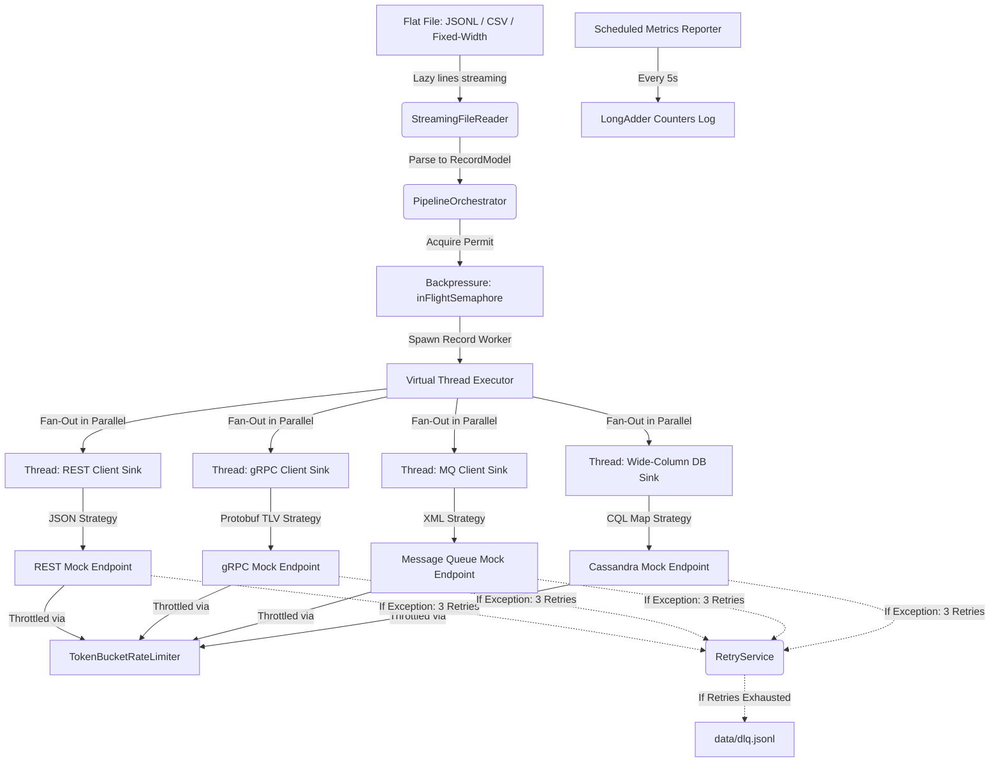

# Distributed Data Fan-Out & Transformation Engine

A high-throughput, low-memory, reactive data fan-out pipeline built in **Java 21** using **Spring Boot**, **Virtual Threads**, and custom-tailored resilience/throttling frameworks.

---

## 1. Setup & Execution Instructions

### Prerequisites
* Java Development Kit (JDK) 21 or higher.
* Maven 3.8+ (wrapper `./mvnw` is included in the project root).

### Build the Project
To compile the classes, compile annotation processors, and package the jar:
```bash
./mvnw clean package
```

### Run Unit and Integration Tests
To execute all 12 tests validating streaming ingestion, formatting, throttling concurrency, and DLQ resilience:
```bash
./mvnw test
```

### Run the Application
To run the main pipeline application:
```bash
./mvnw spring-boot:run
```

---

## 2. Architecture & Data Flow Diagram

The engine follows a structured reactive stream architecture:



---

## 3. Key Design Decisions

### A. Concurrency Model: Java 21 Virtual Threads
* **Blocking Network Latency Mocking:** Network sinks naturally block (waiting on mock sockets, rate-limit acquisitions, or simulated database writes). In traditional platform-thread pools, this causes CPU thread exhaustion.
* **Lightweight Blocking:** By using Virtual Threads (`Thread.ofVirtual().start()`), the JVM suspends/parks the virtual thread upon meeting a rate-limiter delay or mock latency sleep. This allows carrier threads to execute other records, scaling throughput linearly with CPU cores.

### B. Backpressure: Semaphore-Based Pacing
* **Flat Heap Footprint:** Instead of pulling a 100GB file entirely into JVM heap memory (which causes OutOfMemoryErrors), we stream records line-by-line.
* **Flow Control:** We use a bounded `Semaphore(1000)` representing maximum in-flight records. If the database or REST sinks slow down due to throttling, virtual threads take longer to complete, exhausting permits. Once permits are depleted, the stream parsing loop blocks immediately, pacing file read speed to match downstream sink rates.

### C. Transformation Layer: Strategy & Factory Patterns
* **Decoupled Formats:** Sinks are decoupled from transformation logic using a `RecordTransformer` strategy.
* **Dynamic Registration:** The `TransformerFactory` automatically harvests all Spring components implementing the strategy and groups them. Adding a 5th sink requires zero changes to the orchestrator (Extensibility).

---

## 4. Assumptions
1. **CSV Header Schema:** It is assumed that CSV files always start with a single comma-separated header row representing column names.
2. **Fixed-Width Schema:** For fixed-width files, column positions/widths are mapped using the `fixedWidthFields` block defined in the configuration.
3. **Protobuf Wire-Format Sim:** Because we support dynamic, schema-less input payloads, the Protobuf converter encodes properties using a tag-length-value (TLV) Varint encoder, avoiding complex schema compiling plugins while matching Protobuf's binary wire output.

---

## 5. Prompts Used
1. *Setup and Verification:* Setting up properties parsing configurations.
2. *I/O Stream Parser:* Implementing lazy NIO buffer readers and looking ahead to handle commas in quoted CSV entries.
3. *Resilience & Retries:* Wiring exponential backoff schedules and redirecting failed payloads to the Dead Letter Queue.
